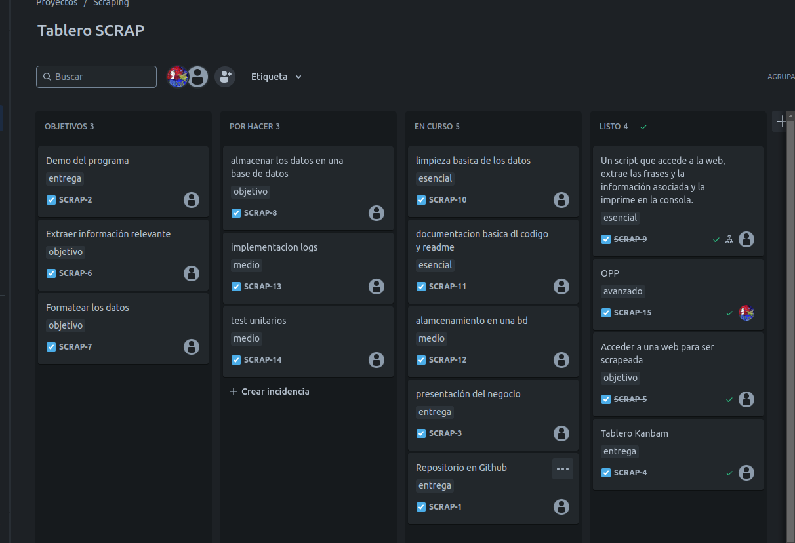

# QuoteScraper

## Descripción

`web_scrap` es una herramienta escrita en Python para raspar citas del sitio web [Quotes to Scrape](http://quotes.toscrape.com/). La herramienta recopila citas, autores y sus biografías, y guarda esta información en archivos CSV.

## Requisitos

Antes de ejecutar `web_scrap.`, asegúrate de tener instaladas las siguientes bibliotecas de Python:

- `requests`
- `beautifulsoup4`
- `pandas`

Puedes instalarlas usando `pip`:

pip install requests beautifulsoup4 pandas

## Uso

### Ejecución del Script

Para ejecutar el script, simplemente usa el siguiente comando:

python web_scrap.py

El script scrapeará todas las páginas disponibles en Quotes to Scrape, recopilando citas y biografías de autores.

## Archivos de Salida
El script generará dos archivos CSV:

- **quotes_data.csv**: Contiene las citas recopiladas junto con los autores y las etiquetas asociadas.
- **authors_data.csv**: Contiene información biográfica de los autores.

## Detalles del Código

### Clase `QuoteScraper`

- `__init__(self, base_url, start_page=1, end_page=None)`: Inicializa la instancia de `QuoteScraper` con la URL base y el intervalo de páginas a scrapear

- `get_quotes_from_page(self, url)`: Raspa todas las citas de una página dada.

- `get_author_info(self, url)`: Obtiene la biografía del autor desde la página del autor.

- `self.start_page = start_page`: página de inicio

- `self.end_page = end_page`: página de fin

- `logging.basicConfig`: registro de logs

### Ejemplo de Uso

A continuación se muestra un ejemplo básico de cómo utilizar la clase `QuoteScraper`:

if __name__ == "__main__":
    base_url = "https://quotes.toscrape.com"
    scraper = QuoteScraper(base_url, start_page=1, end_page=9)
    scraper.scrape_all_quotes()
    scraper.save_to_csv()

## Contribuciones

Si deseas contribuir a este proyecto, por favor sigue estos pasos:

1. Haz un fork del repositorio.
2. Crea una rama para tu nueva característica (`git checkout -b "nueva-caracteristica"`).
3. Haz commit de tus cambios (`git commit -m 'Añadir nueva característica'`).
4. Empuja tu rama (`git push origin nueva-caracteristica`).
5. Crea un Pull Request.

## Licencia

Este proyecto está licenciado bajo los términos de la licencia Creative Commons &copy; Creative Commons CC BY 4.0 Atribución/Reconocimiento 4.0 Internacional.
Usted es libre de:
C- **Compartir** — copiar y redistribuir el material en cualquier medio o formato para cualquier propósito, incluso comercialmente.
- **Adaptar** — remezclar, transformar y construir a partir del material para cualquier propósito, incluso comercialmente.
- La licenciante no puede revocar estas libertades en tanto usted siga los términos de la licencia.

### Bajo los siguientes términos:
- **Atribución** — Usted debe dar crédito de manera adecuada, brindar un enlace a la licencia, e indicar si se han realizado cambios. Puede hacerlo en cualquier forma razonable, pero no de forma tal que sugiera que usted o su uso tienen el apoyo de la licenciante.
- **No hay restricciones adicionales** — No puede aplicar términos legales ni medidas tecnológicas que restrinjan legalmente a otros a hacer cualquier uso permitido por la licencia.

Más información en: https://creativecommons.org/licenses/by/4.0/ 

## organizacion

El tablero kanbam puede consultarse en https://leiber.atlassian.net/jira/software/projects/SCRAP/boards/3?selectedIssue=SCRAP-3

